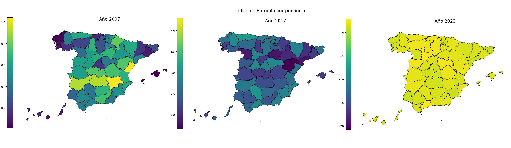
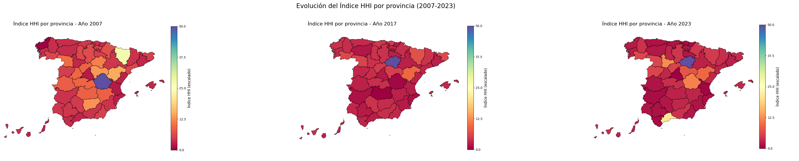
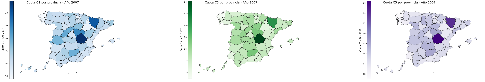
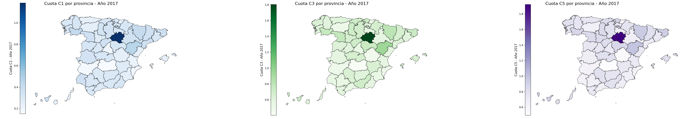
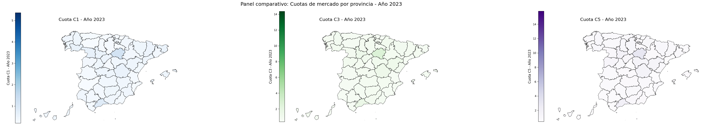

# Píldoras.TFG-Concentracion-Bancaria-Espana
# Concentración bancaria y exclusión financiera en España (2007‑2023)

Trabajo Fin de Grado presentado en la Universidad de Murcia (convocatoria extraordinaria de julio, curso académico 2024‑2025), ante tribunal académico del Grado en Economía.

Este repositorio resume el análisis territorial de la concentración bancaria por provincias en España y su relación con el riesgo de exclusión financiera. El foco está en la evolución entre 2007, 2017 y 2023 y en cómo cambian los patrones de competencia en la llamada “España vaciada”. 

Project presented at the University of Murcia, before the academic board of the Economics Degree.

This repository summarizes a territorial analysis of banking concentration by Spanish provinces and its relationship with the risk of financial exclusion. The focus is on the evolution in 2007, 2017 and 2023, and on how competition patterns change in what is known as “empty Spain”.

## Objetivo del proyecto

El objetivo principal es medir la evolución de la concentración de bancos, cajas de ahorro y cooperativas de crédito a nivel provincial, en los tres períodos, y relacionarla con el acceso de la población a servicios bancarios presenciales. En el EDA del cuaderno de Jupyter anexo se hace también un análisis por comunidades autónomas, pero la escala provincial es la más adecuada para estudiar la diversidad.

The main goal is to measure the evolution of banking concentration of banks, savings banks and credit cooperatives at provincial level in three key years, and to relate it to the population’s access to in‑person banking services. The exploratory analysis in the Jupyter notebook also includes autonomous communities, but the provincial scale is the most suitable to capture territorial diversity.

Para ello se combinan tres tipos de indicadores clásicos de competencia bancaria:

- **Índice Herfindahl‑Hirschman (HHI)**, aplicado a cuotas de mercado medidas por número de oficinas por entidad y provincia.  
- **Cuotas de mercado C1, C3 y C5**, que recogen el peso de la primera, las tres y las cinco mayores entidades de depósito de cada provincia.  
- **Índice de entropía**, interpretado como medida inversa de concentración y diversidad del mercado.

## Metodología y estructura del repositorio / Methods and repository structure

Los datos utilizados proceden de fuentes oficiales y sectoriales (Banco de España, AEB, CECA, UNACC y Observatorio para la Inclusión Financiera). El tratamiento de datos se ha realizado en Python, siguiendo una adaptación del esquema CRISP‑DM (entendimiento del problema, preparación de los datos, modelado descriptivo y evaluación). 

Por motivos de autoría y confidencialidad de las bases originales, **los datasets depurados y los scripts de descarga no se publican en este repositorio**. Puesto que han sido limpiados y ordenados con conocimiento de negocio.

The data come from official and sectoral sources (Bank of Spain and main banking associations). The data processing is done in Python, following an adapted CRISP‑DM workflow (problem understanding, data preparation, descriptive modelling and evaluation).

For reasons of authorship and confidentiality, the cleaned datasets and download scripts are **not** published in this repository.

La estructura del repositorio es:

- `README.md` – Descripción del proyecto, principales conclusiones y enlaces a las visualizaciones. Project description, key findings and links to the visualisations.   
- `notebooks/` – Cuaderno Jupyter con el análisis aplicado y la generación de los mapas coropléticos.  Jupyter notebook with the analysis and map generation.
- `figures/` – Mapas finales listos para su consulta y reutilización en presentaciones o trabajos académicos.  Final maps ready to be reused in presentations or academic work.

> Nota metodológica: Para facilitar la interpretación gráfica, el **índice HHI se ha normalizado y reescalado** en las visualizaciones. Esta transformación no altera las conclusiones económicas del análisis comparado entre provincias y años, pero mejora la legibilidad de los mapas. Los mapas se han realizado usando un arrchivo de vectores .svg de las provincias españolas, de libre descarga en el Instituto geográfico nacional.

> Methodological note: for better graphical interpretation, the **HHI index is normalised and rescaled** in the visualisations. This does not change the economic conclusions, but improves the readability of the maps. Choropleth maps are built from an SVG vector file of Spanish provinces from the National Geographic Institute.

## Principales conclusiones / Main findings

De forma muy sintética, el trabajo muestra:

- Un **aumento muy acusado de la concentración bancaria provincial** entre 2007 y 2023 según el HHI, con un número creciente de provincias clasificables como mercados altamente concentrados y algunas cercanas a situaciones de oligopolio.  
- Una **reducción de las diferencias regionales**: casi todas las provincias han empeorado, de modo que las menos concentradas se han acercado a los niveles de concentración de las provincias más críticas.  
- Una concentración especialmente elevada en provincias interiores envejecidas, en determinadas islas y en territorios más representativos de la “España vaciada”, donde el cierre de oficinas refuerza el riesgo de exclusión financiera geográfica.  
- Las **cooperativas de crédito** mantienen la actuación como banca de proximidad relevante en algunos territorios, pero su red todavía es insuficiente para compensar plenamente la pérdida masiva de capilaridad del sistema bancario tradicional.  

- A **sharp increase in provincial banking concentration** between 2007 and 2023 according to HHI, with more provinces becoming highly concentrated markets and some approaching oligopolistic situations.  
- A **reduction in regional disparities**: almost all provinces have worsened, so initially less concentrated areas have converged towards the most concentrated ones.  
- Particularly high concentration in ageing inland provinces, certain islands and territories representative of “empty Spain”, where branch closures reinforce the risk of geographical financial exclusion.  
- **Credit cooperatives** still act as relevant proximity banking in some territories, but their network is not large enough to fully offset the loss of branch capillarity.
- 
## Visualizaciones / Maps (mapas en `figures/`)

A continuación se visualizan alguno de los mapas principales generados durante el TFG. 

### Índice de entropía por provincia

### Índice HHI (normalizado y reescalado)

### Cuotas de mercado C1, C3 y C5

## 👤 Author / Autor

Created by **Jose Miguel Artiles** – Data Scientist & Economist-in-training.  

- GitHub: [JM-specialist-network](https://github.com/JM-specialist-network)  
- Email: joseartiles@g***l.com
- Para la obtención de los datos en origen RAW, el trabajo, o el Notebook completo, contactar conmigo al email que aparece en mi perfil.

